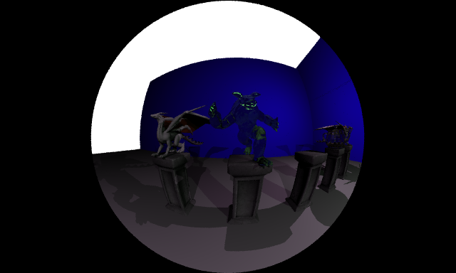
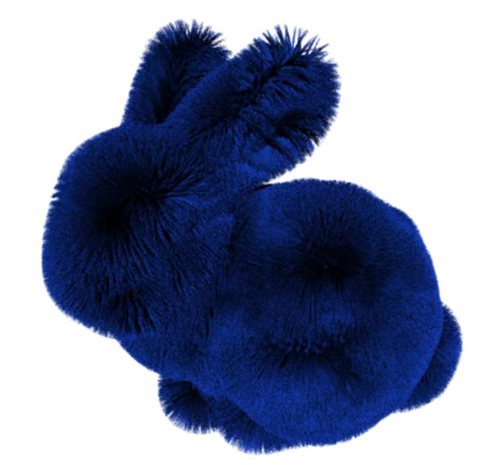
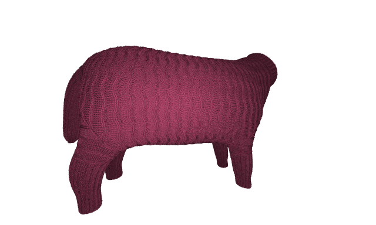
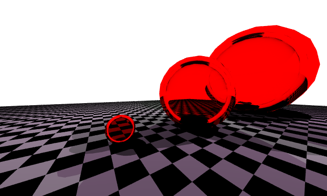
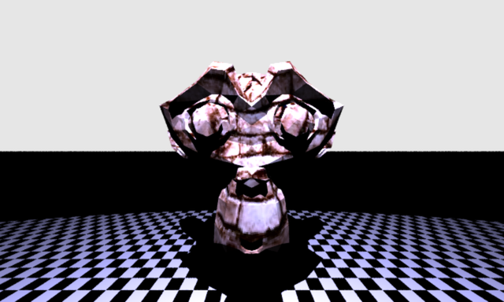
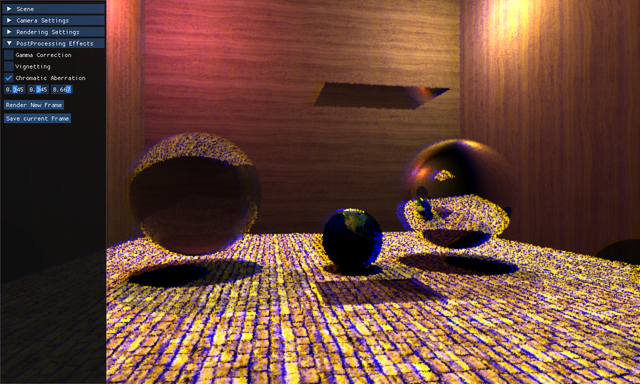

# Tracey 
## Introduction

Tracey is a real time written for the Advanced Graphics Course at Utrecht University, taught by Professor J. Bikker.

The project has been written in C++, rendering the image to a framebuffer presented to the user through an OpenGL texture thanks to the GLFW API and GLAD.

ImGUI is used to itneract with the scene, GLM hass been chosen to provide us with all the matrices operation and linear algebra we needed.


## Camera

Tracey supports a user controllable camera that can be moved with the usual WASD key combination and can be rotated around using the mouse.

The camera supports both Fisheye and Barrel distortion effects, generated by deforming the rays that are hitting the scene.




## Configuration

Tracey can be configured through a config.txt file that is read at the start of the binary.

```

MAX_BOUNCES=3
SAMPLES=1
FPS_LIMIT=60
TILE_WIDTH=8
TILE_HEIGHT=8
W_WIDTH=640
W_HEIGHT=384
# 0 To go fullscreen on your primary monitor
SCALING=2
THREADS=-1

```

## Primitives

Tracey supports triangular meshes, in the form of OBJ files, and bezier curves in the form of BCC and BEZ (after using our conversion script) files to implement [Phantom Ray Hair Intersector](https://research.nvidia.com/publication/2018-08_Phantom-Ray-Hair-Intersector) by Reshetov and Luebke (2018).





## Textures and Materials

Both meshes and curves support three different kind of materials: *Diffuse*, *Dielectric* and *Mirror*. Each material must have a texture.
A texture can either be *Solid Color*, *Checkerboard* or an *Image Texture*






## Lights

Tracey supports 4 different light types:

- *Directional Lights*: described by position and direction;
- *Point Lights*: described by its position;
- *Spot Light*: described by a position, direction and its cutoff angle;
- *AmbientLight*;


## BVH
 We construct a BVH for each unique mesh. This BVH has an identity transform. Then for each instance of the mesh in the scene, we create a top level BVH with only one leaf which is the base mesh.
 
This top level BVH has a unique transform which is specified in the JSON scene. This instancing allows us to render multiple copies of the same mesh without needing to construct identical mesh BVHs.

All of the BVHs in the scene are then combined into what we call the Scene BVH which is a top level BVH containing all other BVHs in the scene. This is done by taking the two BVHs with the smallest surface area and joining them in a top level BVH. This process is repeated until there is only one BVH remaining which has BVHs as its leaves.

Traversal for any of our BVHs is the same. We transform the ray upon entering, then traverse the nodes of the BVH. We check to see if we hit the AABB of each child node and traverse the closest hit child first. If we get to a leaf, we check the intersection with all elements in the leaf.

### Binning and SAH

Binning has been achieved by binned triangles with respect to their centroid. We use 16 bins and implemented horizontal multi-threading for nodes with more than 20,000 triangles. We found this to be a good threshold before the overhead of adding tasks to the thread pool resulted in slower construction times than a single thread. We attempted vertical threading, but ran into issues constructing the final indices array. 

We provide the option for construction of a High Quality BVH by checking all possible centroid partitions across all three axes. This BVH was added for possible future work regarding animations where the BVH could be constructed offline for static meshes. 

### Midpoint

The possibility to build a BVH using the midpoint split has been added as a faster alternative to the SAH. 
This will be helpful for when a refitting of a mesh' BVH will be needed (i.e. non rigid body animations).

Just like for the SAH heuristic the split is made recursively along the longest axis of the Bounding Box of the node.

### Refitting 

The option for a mesh to be refitted at every animation frame is added but it's not currently useful as all supported animations are rigid-bodies that can be applied to the mesh instance's BVH with just a rebuilding of the Top Level BVH.

Nonetheless, when the BVH of a mesh has the \textbf{refit} flag set to true, the bounding box of each node will be recursively recomputed starting from the leaves going backward from the last primitive to the first one in the node.

To avoid losing too much time performances when traversing the tree after refitting, the entire mesh BVH is rebuilt after 2 refitting operations. 

## Animation

Each instance can have multiple frames of animation.

The mesh transform is linearly interpolated between the current and the next frame based on an accumulator value incremented with the delta time computed after each frame.

Each frame can have a different easing function that will be used to tweak the "percentage of the animation between the next transform and the one from the previous frame. If an easing function is not specified in the json file, a simple linear interpolation will be used.


## Scenes 

Scenes are described through a json file, parsed using Niel Lhmann [json library](https://github.com/nlohmann/json).

The Scene file defines a camera (position, front and up direction, FOV), a list of textures, a list of materials, a list of meshes to be instantiated, the actual list of instances and a list of lights.

Each mesh the path to an OBJ file and, optionally, a material. If the material field is not present, Tracey will use the one defined in the mtl field.

Each instance must specify its mesh and, optionally, the BVH type, animation keyframes and a transformation object.


An example of a basic json scene:

~~~~~~~
{
	"camera" : {
		"position": [0.0, 1.0, 4.0],
		"dir": [0.0, 0.0, -1.0],
		"up": [0.0, 1.0, 0.0],
		"fov": 90
	},
	"textures" : [
		{
			"name": "SolidGold",
			"type":"SOLID_COLOR",
			"color": [1.0, 0.8, 0.0]
		}
	],
	"materials": [
		{
			"type": "DIELECTRIC",
			"name": "GoldMirror",
			"texture": "SolidGold",
			"ior": 0.470
		}
	],
	"instance_meshes": 
	[
		{
			"path": "./obj/cat.obj",
			"name": "Cat",
			"material": "GoldMirror",
			"bvh": "SAH"
		},
		{
			"path": "./obj/pillar.obj",
			"name": "Pillar",
			"bvh": "MIDPOINT"
		}
	],
	"scenegraph": 
	[
		{
			"meshes": [
				{
					"name": "Cat",
					"transform": {
						"scale": 0.5,
						"translation": [0.0, 1.8, 0.0],
						"rotation": [0,0,45]
					}
				},
				{
					"name": "Pillar"
				}
			]
		}
	],
	"lights": [
		{
			"type": "DIRECTIONAL",
			"direction": [0.0, -0.6, -0.4],
			"color": [ 0.7, 0.7, 1.0 ],
			"intensity": 0.8
		},
		{
			"type": "DIRECTIONAL",
			"direction": [0.0, -0.6, 0.4],
			"color": [ 0.7, 0.7, 1.0 ],
			"intensity": 0.8
		}
	]
}
~~~~~~~


## Multithreading

Ray tracing is obviously the perfect task for multithreading, hence to obtain faster renders the framebuffer is split into tiles and each tile is given to a thread in a threadpool. Each thread owns a different seed for a Xorshift RNG. 

## Postprocessing

Tracey supports three different non-descructive post processing operations, applied to a copy of the frame buffer.

Tracey supports *Chromatic Aberration*, *Gamma Correction* and *Vignetting*, all of them configurable trough the ImGUI interface.



